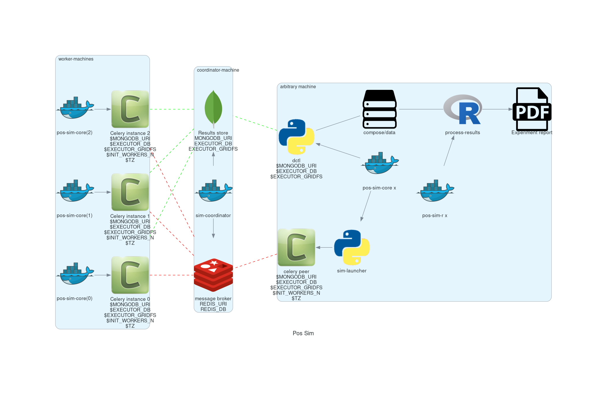

# Table of Contents

1.  [Intro](#org2145a5f)
2.  [Standard mode](#org9f5cdd2)
    1.  [Installation](#org2e82417)
    2.  [Usage](#orga48a2d7)
    3.  [Test the installation](#org95a6f59)
        1.  [NOTE](#org8f35991)
    4.  [Using as library](#org953adc1)
        1.  [Simple experiment](#org186ec45)
    5.  [Experiment definition grammar](#orgd424132)
    6.  [Experiment definition convention](#org4d5d09f)
3.  [Docker mode](#org030ebbe)
    1.  [Ensuring docker installation](#orgf183aab)
    2.  [Installing the project's image](#orgdb8501f)
    3.  [Start a session](#orga6a9a9b)
4.  [Multiprocess distributed execution](#orgf951ed2)
    1.  [Coordination](#orgd672eb5)
    2.  [Workers](#org6e46a86)
    3.  [Launcher](#org4ad8e9a)
    4.  [Retrieving results](#org9f42516)
    5.  [Configuring the distributed system](#org306716a)
        1.  [Config doctor](#org012a15e)
    6.  [Monitoring the distributed system](#orgcbb365b)
5.  [Results analysis](#orge74d9f0)
6.  [Project structure](#org4086ac3)
    1.  [Locs](#org5a7dbed)
7.  [Images sha256sum](#org949b5b3)

# Intro

This document acts as technical appendix for the bachelor project pos-sim-0.1

It gives hands on instruction to use the library and reproduce the experiments.

For documentation of the actual code see <https://139.162.161.39/public/thesis/build/html/index.html>.

# Standard mode

## Installation

This section applies for GNU/linux systems.
It should also work on OSX (mac) if a python (>3) and
pip are installed.

Clone the repo (<https://github.com/bandoos/bachelor-project>) of the
project to a location we will refer to as `$PROJECT_ROOT`

The alternative is using the provided Docker images,
which will work on GNU/linux, OSX and windows. See the
**Docker mode** section for instructions.

**NOTE** about using virtualenv

Using virtualenv to avoid python libraries versions
conflicts is encouraged.

if virtualenv is not installed on your system yet
it can be installed with pip

`$ pip install --user virtualenv`

check installation

`$ virtualenv --version`

create an env directory

    $ mkdir sim-core-env
    $ cd sim-core-env
    $ virtualenv venv

then from sim-core-env activate the environment

`$ source ./venv/bin/activate`

The terminal prompt should now display the name of the environment
to signal it is active.

The code is bundled as a python package so,
from the root folder of the project run:

`$ pip install --user -e ./`

This will use `pip` to install (for the current user)
the dependencies of the project from PyPI, and add this project
to the `$PYTHONPATH` so it can be executed on your system.

Thought this is not necessary for the basic functionality
some features rely on `$HOME/.local/bin` to be in the `$PATH`.
This is typically the case with standard linux distribution,
but the install command will warn if this is not the case
for you.

If using virtualenv once the environment is activated the `$PATH`
is manipulated appropriately automatically.

If `.local/bin` is in your `$PATH` then the main entry point
for the simulation executable is available as:

`$ sim-stake [OPTIONS]`

If `.local/bin` is not in your $PATH then from the `$PROJECT_ROOT`
run:

`$ python -m sim.core.main [OPTIONS]`.

In that case remember that you should always be in `$PROJECT_ROOT`
and substitute `sim-stake` with `python -m sim.core.main` in the following sections.

## Usage

You can see its usage information with:

`$ sim-stake --help`

    usage: sim-stake [-h] [--id ID]
    		 --m M --T T
    		 --c C --times TIMES
    		 --stake_f {eq,beta,pareto}
    		 --sim {random,const,geom,log_const,log_geom}

    Run a sim-stake-batch

    optional arguments:
      -h, --help            show this help message and exit
      --id ID               unique id for the experiment

    required arguments:
      --m M                 INTEGER: Indicate the number of nodes [m] (valid if >= 2)
      --T T                 INTEGER: Indicate max epoch time [T] (valid if >= 2)
      --c C                 FLOAT: Indicate total load factor "c" [R=cT] (valid if > 0)
      --times TIMES         INTEGER: Redudancy factor (valid if > 0)
      --stake_f {eq,beta,pareto} STRING: Generator function for inital stake distrib.
      --sim {random,const,geom,log_const,log_geom} STRING: Indicate simulator class

So the program requires a flag for each simulation parameter,
plus an optional id argument. The id argument is not necessary for
basic usage, and i suggest using the docker setup for batch execution
anyways (which manages experiment ids independently)
so it may be removed in subsequent releases.

## Test the installation

An example of well formed command would be:

`$ sim-stake --m 3 --T 200 --c 0.5 --stake_f eq --sim random --times 10`

Which would run the simulation with:

-   \(m=3\) nodes
-   for \(T=200\) epochs,
-   with a load factor \(c=0.5\)
-   initial stake \(stake_f=eq\)
-   \(sim=random\) scheme,
-   repeating the experiment 10 times (\(times=10\))

A csv is produced on standard output which looks like (may overflow page on pdf):

    m,T,c,R,sim,stake_f,var_0,var_T,gini_0,gini_T,under_target,avg_loss,over_target,avg_gain
    3,200,0.4,80.0,random,eq,0.0,0.0001354807,0.0,0.0164609053,0.6666666667,-0.0082304527,0.3333333333,0.0164609053
    3,200,0.4,80.0,random,eq,0.0,0.0013222917,0.0,0.0592592593,0.6666666667,-0.0230452675,0.3333333333,0.046090535
    3,200,0.4,80.0,random,eq,0.0,0.0007207573,0.0,0.0427983539,0.6666666667,-0.0181069959,0.3333333333,0.0362139918
    3,200,0.4,80.0,random,eq,0.0,0.0008833342,0.0,0.046090535,0.6666666667,-0.0205761317,0.3333333333,0.0411522634
    3,200,0.4,80.0,random,eq,0.0,0.0006557266,0.0,0.0362139918,0.6666666667,-0.0181069959,0.3333333333,0.0362139918
    3,200,0.4,80.0,random,eq,0.0,0.0008508188,0.0,0.0427983539,0.6666666667,-0.0205761317,0.3333333333,0.0411522634
    3,200,0.4,80.0,random,eq,0.0,5.4192e-06,0.0,0.0032921811,0.3333333333,-0.0032921811,0.6666666667,0.0016460905
    3,200,0.4,80.0,random,eq,0.0,0.0003305729,0.0,0.0296296296,0.3333333333,-0.0230452675,0.6666666667,0.0115226337
    3,200,0.4,80.0,random,eq,0.0,0.0002655422,0.0,0.0263374486,0.6666666667,-0.0106995885,0.3333333333,0.021399177
    3,200,0.4,80.0,random,eq,0.0,0.0005581805,0.0,0.0362139918,0.3333333333,-0.0329218107,0.6666666667,0.0164609053

All simulation parameters are reported for each row along with
the observed result metrics, so that each result is fully characterized
by its csv output (i.e. 2 outputs can merged in a single dataframe without loss
of information)

Use output redirection to save the results to a file for later inspection:

`$ sim-stake --m 3 --T 200 --c 0.5 --stake_f eq --sim random --times 10 > some_name.csv`

### NOTE

Running the simulation as saw above works for simple tests
with a single parameters combination.
For a full fledged experiment with parameter manipulation see either
section [2.4](#org0ebfd4a) (using as library) or section [3](#org85c2bd3) (docker mode).

## Using as library

Once installed the code can also be used as library.
In the module **sim.core.main** exposes a `run` function
that accepts the parameters you would provide on the command line
as a dictionary (without the `--` prefix on parameters name).

In a python script of your choice:

    import sim.core.main as simulation

    params = {'m':3,
    	  'T':300,
    	  'c':0.5,
    	  'stake_f':'eq',
    	  'sim':'random',
    	  'times':10}

    simulation.run(params)

The run function accepts 2 other optional named parameters:

-   `out_fn` (default = sys.stdout.write)
-   `header` (default = True)

The `out_fn` will be called for each simulation repetition
passing a string being the comma separated values (parameter + response metrics)
i.e. `times` times once per line of the output csv.

The `header` boolean controls whether the header of the csv should be produced
before the first run results.

### Simple experiment

A simple experiment can be conducted by writing a procedure
that runs several simulations:

Let's say we want to manipulate the number of nodes \(m\):

    import sim.core.main as simulation

    ms = range(2,10)

    params = {'m':None,
    	  'T':300,
    	  'c':0.5,
    	  'stake_f':'eq',
    	  'sim':'random',
    	  'times':10}

    header = True
    for m in ms:
        params['m'] = m
        simulation.run(params,header=header)
        if header:
    	header=False

Note that we ensure that the header is only produced
on the first parameter combination so we get a valid csv
as output.

## Experiment definition grammar

Although the above is sufficient for simple experiments,
relying on procedural code may hide the essence of the
experiment in complex scenarios, rendering difficult to infer what
is tested. A more declarative approach ensures readability and clarity.

In order to define experiment in a pleasant way a module
was defined to provide a definition grammar for complex experiments.

The fundamental idea is providing a callable data structure that
represents the Cartesian product of named sets. Once called the ds
will expand to a list of dictionaries where each key assumes one of the
values of its set.

The `sim.executor.batch.ibatch` module provides the constructor `P`
for these Cartesian expansions.

    from pprint import pprint
    from sim.executor.batch.ibatch import P

    p1 = P({'a':{True,False},
    	'b':{True,False}})

    pprint(p1())

Which produces the following output:

    [{'a': True, 'b': True},
     {'a': True, 'b': False},
     {'a': False, 'b': True},
     {'a': False, 'b': False}]

Typically the values of the dictionary provided to the P constructor
will be sets (thus ensuring no duplicates) but any iterable or callable
that returns an iterable is fine, so the following is acceptable:

    from pprint import pprint
    from sim.executor.batch.ibatch import P

    def i_could_be_a_very_complex_function():
        "...complex compute..."
        return {True,False}

    p2 = P({'n': range(1,4),
    	'b': i_could_be_a_very_complex_function})

    pprint(p2())

Which produces:

    [{'b': False, 'n': 1},
     {'b': True, 'n': 1},
     {'b': False, 'n': 2},
     {'b': True, 'n': 2},
     {'b': False, 'n': 3},
     {'b': True, 'n': 3}]

If we only desire a segments of the product (i.e. some value should only
be matched with specific ones) then chaining 2 separate P constructor
suffices. To chain constructors just use the `+` operator:

    from pprint import pprint
    from sim.executor.batch.ibatch import P

    p3 = P({'mode': {"a"},
    	'sub_mode': {"a1","a2"}})

    p4 = P({'mode': {"b"},
    	'sub_mode':{"b1","b2"}})

    p5 = p3 + p4

    pprint(p5())

    [{'mode': 'a', 'sub_mode': 'a1'},
     {'mode': 'a', 'sub_mode': 'a2'},
     {'mode': 'b', 'sub_mode': 'b1'},
     {'mode': 'b', 'sub_mode': 'b2'}]

A real experiment definition for the simulation could be:

    from sim.executor.batch.ibatch import P
    REPETITIONS=10
    REDUNDANCY=2
    batch = P({'m':  [10 ** i for i in range(1,4)], # 3 elems
    	   'T':  [10 ** i for i in range(2,4)], # 2 elems
    	   'c':  [0.001, 0.01, 0.1, 0.5, 1, 2, 10, 100], # 8
    	   'sim':        ['const','geom','log_const','log_geom','random'], # 5 elmes
    	   'stake_f':    ['eq','beta','pareto'], # 3 elems
    	   'times':      [REPETITIONS],
    	   'redundancy': range(REDUNDANCY) })

Which will generate \(3*2*8*5*3=720\) unique parameters configurations,
which are replicated `REDUNDANCY` times (thus 1440 runs) each of which
tests the configuration `REPETITIONS` times (thus 14'400 total simulations).

'redundancy' in this case is a dummy key, the actual simulation
will not read its value, but it still multiplies the number of
generated parameter dictionaries. The reason for having both
'times' and 'redundancy' should become clear when the distributed
multiprocess facility is introduced; in a single process
environment one should just use 'times'.

the above experiment could be run as follows:

    import sim.core.main as simulation
    header = True
    for params in batch():
        simulation.run(params,header=header)
        if header:
    	header=False

A large experiment like the one above may take very long to terminate
which is why the software is meant to be run in a distributed multiprocess
fashion thanks to celery <https://github.com/celery/celery>.

## Experiment definition convention

We adopt the following convention to define experiments:

create a python file in `$PROJECT_ROOT/executor/experiments/`

define the experiment via arbitrary code or using the above presented
grammar and assign the callable or iterable that generates the configurations
to a toplevel variable called `batch`.

Note that you can define experiments wherever you want as long as
the file is in the `$PYTHONPATH` and a `batch` callable or iterable
is present.

The main experiment presented in the paper is located in module
`sim.executor.experiments.exp_0`.

This convention will be important later on in section [4.3](#orge486ee9).

# Docker mode

If not already present on your system install docker:
<https://docs.docker.com/get-docker/>

On linux you may want to use your usual package manager.
On linux, after installation, you need to add your user
to the `docker` group to be able to run docker images
without root privileges. (This is strongly encouraged
rather than using sudo!!)

`# usermod --append -G docker <your-user>`

On macos and windows (using the desktop version of docker)
the docker-compose utility ships by default.
On linux you will have to install it separately:
<https://docs.docker.com/compose/install/>

It quiet intuitively allows to compose docker images/containers.

## Ensuring docker installation

Test the docker installation

`$ docker run --rm hello-world`

This can take a while the first time, but it should
then produce some useful information about docker and exit.

## Installing the project's image

The docker image for this project ships with
a fully functional archlinux system with all
the necessary requirements installed plus some
packages and tweaks to make the experience pleasant
like tab-completion on the project's commands.

Using a pre-built image is suggested; download it from
<http://139.162.161.39/thesis/images/pos-sim-core-latest.tar.gz>
(to check the sha sums see section [7](#orgc6548ca).)

The compressed image is about 1 GB.

once downloaded load it to the docker engine with

`$ docker load < pos-sim-core-latest.tar.gz`

\*\* Launch the system
  
  Once the image is successfully loaded enter
  the `$PROJECT_ROOT/compose` folder and run:

`$ docker-compose up`

This will start the container and mount the
`$PROJECT_ROOT/compose/data` directory to the container's
`~/data` dir. This location can be used as a (persitent) bridge
between your system and the container.

The above command will hang until you decide to
stop it, when so hit CTRL-C to send the shutdown signal,
the system will process it and shutdown gracefully.

Note this is named container so only one instance at a time
can run, that is more than sufficient to run many simulations
in parallel within the container though!

## Start a session

You can start a terminal session within the running system
(from another terminal) with

`$ docker exec -it pos-sim-core /bin/zsh`

This will open a terminal within the container.

Inside you find a copy of `$PROJECT_ROOT`.

All of the project commands are in the `$PATH` there
so they can be called directly. If in doubt you can list them
with `$ ls ~/.scripts`

# Multiprocess distributed execution

To allow for large scale simulations facilities are provided
to run multiple simulations in parallel on multiple machines
thanks to Celery (v4.4.3) <https://docs.celeryproject.org/en/4.4.3/getting-started/resources.html>
coordinated by Redis <https://redis.io/> and storing results on
Mongodb <https://www.mongodb.com/>.

While a setup without docker for this use case is possible
it involves installing the project, mongodb and redis to your system,
and since the purpose of this facility is to deploy easily on several
possibly heterogeneous systems the easiest and more reliable solution
is to just have a docker engine on each machine and rely on the provided
images.

Note that no knowledge about redis or mongodb is required
to carry out the experiments as utilities are provided
for the necessary interactions.

## Coordination

On one machine the **sim-coordinator** system should be run.
Assuming docker and docker-compose are available on the machine
simply enter `$PROJECT_ROOT/sim-coordinator` and run

`$ docker-compose up`

Note that this uses the official redis and mongodb images
so no `docker load` is needed in this case.

This will start the database and redis instances
on predefined ports (see section [4.5](#org8728285) if you want to
change the port numbers for any reason.)

the above command will hang until CTRL-C is pressed
which will start the graceful shutdown.

The workers running the project's code will
receive jobs to execute from redis and produce
results to the database.

Inside of `$PROJECT_ROOT/sim-coordinator` 2 folders are present:

-   `$PROJECT_ROOT/sim-coordinator/mongo-volume`
-   `$PROJECT_ROOT/sim-coordinator/reids-data`

Similarly to `$PROJECT_ROOT/sim-coordinator/compose/data`
these act as bridges with your host system.
The database will persist the data the **mongo-volume** dir
and redis (which by default is not persistent) will do so in the
**redis-data** dir  if configure to be persistent.

No further actions need to be taken with regard to the coordination
system.

## Workers

On each machine that should be targeted by the job
distribution mechanism follow sections [3.2](#orgf89f437) and [3.3](#orgb7c43d2)
to boot the worker environment.

Once you have a session terminal ensure that the system configuration
is correct for your needs (see section [4.5](#org8728285)), and then
simply run:

`$ run-worker`

to have the machine join the distributed system. This will hang until
you hit CTRL-C, and will print information about the system and then log
events.

## Launcher

A launcher is provided in the module `sim.executor.launcher`
which is linked in `.scripts/sim-launcher` for convenience.

You can use the launcher from any of the machines that have
a running (and correctly configured) instance of the project's
docker image.
Another option is launching from a machine (e.g. a laptop)
that will not have a worker running so long as it is properly configured
to contact the distributed system coordinator (see section [4.5](#org8728285)).

it synopsis is as follows:

    usage: sim-launcher [-h] [--exp-module EXP_MODULE] [--async]

    optional arguments:
      -h, --help            show this help message and exit
      --exp-module EXP_MODULE
      --async, -a

The `--exp-module` option controls which experiment will
be loaded and distributed on worker machines. If not provided
a small default experiment is chosen to test the system.
The value provided for the experiment module should be a
fully qualified python module name such as `sim.executor.experiments.exp_0`
just like in an **import** statement, pointing to a module in the `$PYTHONPATH`.
The `batch` variable within that module will be looked up according to
the convention presented in section [2.6](#orga8abe95).

If `--async` is not provided then the launcher will block
until the experiment completes. If `--async` is provided
then the launcher will exit as soon as the dispatching
completes, you can then monitor the progress as explained in
section [4.6](#orgc690a3c)

Once an experiment is successfully launched the coordinator
will distribute the necessary jobs to complete the experiment
to the available workers.

The launcher program outputs some information about the
dispatched experiment. In particular it outputs a python dictionary
whose `batch_uuid` key is what we are interested in for fetching
results later on as explained in section [4.4](#org5335f87).
(If the `--async` flag is on the look for `_batch_uuid`)

## Retrieving results

In distributed mode the database is used to store results
as they are produced.

Once an experiment is finished you can use the utility provided in
`$PROJECT_ROOT/.scripts/dctl` that helps to fetch all the aggregated
results of a full experiment from the database as a csv.

Within the docker environment this is linked to `~/.local/bin`
so you can use it directly

`$ dtcl [cmd] [options]`

in custom environment from `$PROJECT_ROOT` use it by
invoking the full with path

`.scripts/dtcl [cmd] [options]`

It provides 2 cmd(s):

-   `dctl fs ls`
    List the experiment results csv that are available
    in the system.

-   `dctl fs get <batch_uuid>.csv`
    Get a result by name.

Note that from the docker environment tab-completion
is available for the file name, so you just need to remember the
first few characters of the `batch_uuid` and then press tab to complete.

Redirect the output of `dctl fs get` to a file in to save the
results.  If you are running dctl in the docker environment
redirect to `~/compose/data/<filename>.csv` to have the results
visible on the host system. (Remeber `compose/data` acts as
bridge - so called docker volume - between the virtual system in
the docker and your host system).

`$ dctl fs get batch_uuid.csv > destination/name.csv`

substitute `batch_uuid`, `destination` and `name` appropriately.

## Configuring the distributed system

The distributed system is configured via the following environment
variables:

1.  `MONGDB_URI`
    Defines the address of the database in the following format:

    **mongdb://<ip-adress>:<ip-port>**

    so for example assuming the coordinator
    was launched on a machine on
    192.168.178.31 on the default port:

    **mongodb://192.168.178.31:27020**

    default **mongodb://0.0.0.0:27020**

1.  `EXECUTOR_GRIDFS`
    The name of the internal database to use as distributed
    filesystem, the default is **executor-gridfs**

2.  `EXECUTOR_DB`
    The name of the internal database to use for task metadata
    and partial results, default is **from-celery**

3.  `REDIS_URI`
    Similar to `MONGODB_URI` but for the redis server,
    default is

    **redis://0.0.0.0:6399**

4.  `REDIS_DB`
    The number (redis uses integers to identify the dbs) of the redis
    internal database to use. Default \(2\)

5.  `INIT_WORKERS`
    The number of workers (processes) to run concurrently
    if the machine is used as worker node.

6.  `TZ`
    The timezone to use (must be consistent on all machines for
    proper coordination). Defaults to **Europe/Amsterdam**, must be a valid
    timezone value.

Ideally you want to modify only the URI(s), `TZ` and `INIT_WORKERS`.

the suggested manner of configuration is putting all the values in
a .env file like the following:

    MONGODB_URI=mongodb://0.0.0.0:27020
    EXECUTOR_GRIDFS=executor-gridfs
    EXECUTOR_DB=from_celery

    REDIS_URI=redis://0.0.0.0:6399
    REDIS_DB=2

    INIT_WORKERS_N=4

    TZ=Europe/Amsterdam

Environment variables must be established for each running
terminal session. An utility is provided in `$PROJECT_ROOT/.scripts/source-env.sh`,
use it as follows from `$PROJECT_ROOT`

`$ source .scripts/source-env.sh <path-to-env-file>`

The default .env file is located at `$PROJECT_ROOT/compose/defaults.env`.

Please note that you have to source your (or the default) .env file
for each session! In each session use the config doctor from
section [4.5.1](#org0f1a8ab) to ensure the system is configured correctly.

NOTE: To streamline configuration you can edit
`$PROJECT_ROOT/compose/defaults.env` before distributing the
project to your machines, the variables in this file will be loaded
automatically when you start a pos-sim-core docker by following
instruction in section [3.2](#orgf89f437). If you then still need to change
them at runtime you will have to soruce the file from inside the
container again as explained above.

### Config doctor

Another utility is provided at which will validate the configuration and verify that the
coordination services are reachable.

It requires no arguments as it reads the environment vars.

You can invoke the `config-doctor` by running:

`$ python -m sim.executor.config-doctor`

## Monitoring the distributed system

The status of the distributed system can be monitored with a web-ui
provided by `flower` (<https://flower.readthedocs.io/en/latest/>).

Start a new session on one of the machines running the project's
docker images (not the coordinator!)

`$ docker exec -it pos-sim-core /bin/zsh`

once the session starts run:

`$ launch-flower`

If no active worker is found this may log some warnings like:
`'stats' inspect method failed`, don't worry, as soon as
a worker connects the system will heal automatically.

The docker exposes port 5555 so you can open a browser
on that machine (outside of docker that is) and point it
to <http://0.0.0.0:5555>

Note that the graphs are not retroactive so keep a tab
open on the graph page and do not reload.

# Results analysis

Experiment results are analyzed with R code.  Compiling R
dependencies may take a lot of time (nearly 30 minutes for the
dependencies of `analyze.Rmd` on an medium tier laptop), and errors
in the process may harm the reproducibility of the
analysis. Therefore a third docker image is provided which ships
with all the dependencies compiled in it, and when run exposes an
R-studio web interface to run (and possibly customize) the analysis.

Whether you produced results via single process code, or via the
distributed system you will have one or more csv files with results
to analyze.

If running via the distributed system use `dctl`
utility [dctl](#dctl) to retrieve form the database with the desired csv.

The analysis
can be performed by the R script provided in `$PROJECT_ROOT/pos-sim-r/analyze.Rmd`.

You should run the analysis docker on the machine where you downloaded
the results via `dctl` or transfer the csv files to another machine
and then use that one.

Copy the results csv file to `$PROJECT_ROOT/pos-sim-r/data/exp_data/`.

NOTE: `$PROJECT_ROOT/pos-sim-r/data` is a docker volume that will be mounted
when the image is run, so you can copy from your host system with `cp` or
drag/drop and the changes will be reflected inside the container.

NOTE: The analysis script will merge all files that it finds in the `exp_data`
directory so be careful to only have the files you desire in there
later when you run the script. If you create other data folders you can control
which is used by ediding the first cell of `analyze.Rmd` where **data.folder** is defined.

Download the image from
<http://139.162.161.39/thesis/images/pos-sim-r-latest.tar.gz>
(to check the sha sums see section [7](#orgc6548ca).)

Load the image to the docker engine:

`$ docker load < pos-sim-r-latest.tar.gz`

Enter `$PROJECT_ROOT/pos-sim-r`. Edit the **defaults.env** file to
change the default password ('foobarbaz') for the R-studio server.
(The username is always 'rstudio'). Now run

`$ docker-compose up`

As usual this will hang until you stop it with CTRL-C

Point a browser to R-studio web-ui on <http://localhost:8787>. It will ask
to login with password you provided in **defaults.env**.

enter the `projects` folder and Open the analyze.Rmd file, press 'knit'.

Alternatively run from the rstudio terminal: `$ make render`.

Assuming valid data is found in `projects/exp_data` within the
docker, the analyze.Rmd will produce a pdf/markdown/html (depending
on kint options, defaults to html) file that presents all the
results. The file will be saved in the docker `projects/` folder and
is therefore also present on your host machine in
`$PROJECT_ROOT/pos-sim-r/data`.

The main experiment discussed in the project's paper is at: <http://139.162.161.39/thesis/analyze.html>

Yours will be available locally: at <http://localhost:8787/files/projects/analyze.html>

# Project structure

    PROJECT_ROOT
    .
    |-- compose
    |   |-- data
    |   |   `-- .gitgignore
    |   |-- defaults.env
    |   |-- docker-compose.yml
    |   |-- vars.env
    |   `-- vars.wan.env
    |-- Dockerfile
    |-- .dockerignore
    |-- doc_source
    |   |-- conf.py
    |   |-- index.rst
    |   `-- _static
    |-- .gitignore
    |-- Makefile
    |-- pipinstalls.txt
    |-- pos-sim-r
    |   |-- data
    |   |   |-- analyze.html
    |   |   |-- analyze.Rmd
    |   |   |-- exp_data
    |   |   |   `-- .gitkeep
    |   |   |-- figure
    |   |   |   |-- .gitkeep
    |   |   |   `-- score_contour.jpg
    |   |   |-- makefile
    |   |   `-- make.r
    |   |-- defaults.env
    |   |-- docker.build.sh
    |   |-- docker-compose.yml
    |   |-- Dockerfile
    |   `-- install_deps.r
    |-- README.html
    |-- README.md
    |-- README.org
    |-- README.pdf
    |-- .scripts
    |   |-- add-aur.sh
    |   |-- dctl
    |   |-- get-batch-file
    |   |-- install.sh
    |   |-- launch-flower
    |   |-- list-batch-files
    |   |-- revoke-sudo.sh
    |   |-- run-worker
    |   |-- sim-launcher
    |   |-- sim-stake1
    |   |-- source-env.sh
    |   |-- tabulate.sh
    |   `-- welcome.sh
    |-- setup.cfg
    |-- setup.py
    |-- sim
    |   |-- cmd
    |   |   `-- ucmd.py
    |   |-- core
    |   |   |-- abstract_sim.py
    |   |   |-- base_object.py
    |   |   |-- boot_exp.py
    |   |   |-- decorators.py
    |   |   |-- ecdf.py
    |   |   |-- implem.py
    |   |   |-- __init__.py
    |   |   |-- main.py
    |   |   |-- node.py
    |   |   |-- parser.py
    |   |   |-- plot.py
    |   |   |-- rew_f.py
    |   |   |-- sel_f.py
    |   |   |-- sim_0.py
    |   |   |-- stake_f.py
    |   |   `-- utils.py
    |   |-- executor
    |   |   |-- batch
    |   |   |   `-- ibatch.py
    |   |   |-- celeryconf.py
    |   |   |-- config-doctor.py
    |   |   |-- db
    |   |   |   |-- cmd.py
    |   |   |   |-- fs.py
    |   |   |   |-- logger.py
    |   |   |   `-- parser.py
    |   |   |-- dbdriver.py
    |   |   |-- experiments
    |   |   |   |-- exp_01.py
    |   |   |   |-- exp_0.py
    |   |   |   |-- exp_365.py
    |   |   |   |-- exp_const_geom_pt2.py
    |   |   |   |-- exp_const_geom.py
    |   |   |   |-- exp_log.py
    |   |   |   `-- foo.py
    |   |   |-- launcher.py
    |   |   |-- logger.py
    |   |   `-- tasks.py
    |   `-- parser
    |       `-- aparse.py
    |-- sim-coordinator
    |   |-- docker-compose.yml
    |   |-- mongo-volume
    |   |   |-- .gitignore
    |   |   `-- README.txt
    |   `-- redis-data
    |       |-- .gitignore
    |       `-- README.txt
    `-- todo.org

    20 directories, 86 files

## Locs

<table border="2" cellspacing="0" cellpadding="6" rules="groups" frame="hsides">

<colgroup>
<col  class="org-left" />

<col  class="org-right" />

<col  class="org-right" />

<col  class="org-right" />

<col  class="org-right" />

<col  class="org-right" />
</colgroup>
<tbody>
<tr>
<td class="org-left">Language</td>
<td class="org-right">Files</td>
<td class="org-right">Lines</td>
<td class="org-right">Blank</td>
<td class="org-right">Comment</td>
<td class="org-right">Code</td>
</tr>

<tr>
<td class="org-left">Python</td>
<td class="org-right">41</td>
<td class="org-right">3121</td>
<td class="org-right">776</td>
<td class="org-right">316</td>
<td class="org-right">2029</td>
</tr>

<tr>
<td class="org-left">`./executor/dbdriver.py`</td>
<td class="org-right">&#xa0;</td>
<td class="org-right">381</td>
<td class="org-right">96</td>
<td class="org-right">23</td>
<td class="org-right">262</td>
</tr>

<tr>
<td class="org-left">`./executor/tasks.py`</td>
<td class="org-right">&#xa0;</td>
<td class="org-right">168</td>
<td class="org-right">44</td>
<td class="org-right">12</td>
<td class="org-right">112</td>
</tr>

<tr>
<td class="org-left">`./core/boot_exp.py`</td>
<td class="org-right">&#xa0;</td>
<td class="org-right">144</td>
<td class="org-right">32</td>
<td class="org-right">3</td>
<td class="org-right">109</td>
</tr>

<tr>
<td class="org-left">`/core/test/stake-sim-0.py`</td>
<td class="org-right">&#xa0;</td>
<td class="org-right">159</td>
<td class="org-right">35</td>
<td class="org-right">15</td>
<td class="org-right">109</td>
</tr>

<tr>
<td class="org-left">`executor/config-doctor.py`</td>
<td class="org-right">&#xa0;</td>
<td class="org-right">137</td>
<td class="org-right">33</td>
<td class="org-right">0</td>
<td class="org-right">104</td>
</tr>

<tr>
<td class="org-left">`./executor/launcher.py`</td>
<td class="org-right">&#xa0;</td>
<td class="org-right">195</td>
<td class="org-right">55</td>
<td class="org-right">39</td>
<td class="org-right">101</td>
</tr>

<tr>
<td class="org-left">`./core/sim_0.py`</td>
<td class="org-right">&#xa0;</td>
<td class="org-right">144</td>
<td class="org-right">35</td>
<td class="org-right">11</td>
<td class="org-right">98</td>
</tr>

<tr>
<td class="org-left">`/executor/batch/ibatch.py`</td>
<td class="org-right">&#xa0;</td>
<td class="org-right">145</td>
<td class="org-right">41</td>
<td class="org-right">10</td>
<td class="org-right">94</td>
</tr>

<tr>
<td class="org-left">`./core/abstract_sim.py`</td>
<td class="org-right">&#xa0;</td>
<td class="org-right">123</td>
<td class="org-right">29</td>
<td class="org-right">14</td>
<td class="org-right">80</td>
</tr>

<tr>
<td class="org-left">`./parser/aparse.py`</td>
<td class="org-right">&#xa0;</td>
<td class="org-right">113</td>
<td class="org-right">23</td>
<td class="org-right">13</td>
<td class="org-right">77</td>
</tr>

<tr>
<td class="org-left">`./core/plot.py`</td>
<td class="org-right">&#xa0;</td>
<td class="org-right">88</td>
<td class="org-right">16</td>
<td class="org-right">4</td>
<td class="org-right">68</td>
</tr>

<tr>
<td class="org-left">`./core/decorators.py`</td>
<td class="org-right">&#xa0;</td>
<td class="org-right">78</td>
<td class="org-right">12</td>
<td class="org-right">1</td>
<td class="org-right">65</td>
</tr>

<tr>
<td class="org-left">`./core/implem.py`</td>
<td class="org-right">&#xa0;</td>
<td class="org-right">94</td>
<td class="org-right">23</td>
<td class="org-right">10</td>
<td class="org-right">61</td>
</tr>

<tr>
<td class="org-left">`./executor/db/fs.py`</td>
<td class="org-right">&#xa0;</td>
<td class="org-right">94</td>
<td class="org-right">30</td>
<td class="org-right">9</td>
<td class="org-right">55</td>
</tr>

<tr>
<td class="org-left">`./core/utils.py`</td>
<td class="org-right">&#xa0;</td>
<td class="org-right">64</td>
<td class="org-right">12</td>
<td class="org-right">1</td>
<td class="org-right">51</td>
</tr>

<tr>
<td class="org-left">`./core/node.py`</td>
<td class="org-right">&#xa0;</td>
<td class="org-right">62</td>
<td class="org-right">13</td>
<td class="org-right">3</td>
<td class="org-right">46</td>
</tr>

<tr>
<td class="org-left">`./core/main.py`</td>
<td class="org-right">&#xa0;</td>
<td class="org-right">67</td>
<td class="org-right">18</td>
<td class="org-right">5</td>
<td class="org-right">44</td>
</tr>

<tr>
<td class="org-left">`./core/base_object.py`</td>
<td class="org-right">&#xa0;</td>
<td class="org-right">66</td>
<td class="org-right">16</td>
<td class="org-right">9</td>
<td class="org-right">41</td>
</tr>

<tr>
<td class="org-left">`./cmd/ucmd.py`</td>
<td class="org-right">&#xa0;</td>
<td class="org-right">54</td>
<td class="org-right">11</td>
<td class="org-right">3</td>
<td class="org-right">40</td>
</tr>

<tr>
<td class="org-left">`./core/parser.py`</td>
<td class="org-right">&#xa0;</td>
<td class="org-right">54</td>
<td class="org-right">14</td>
<td class="org-right">1</td>
<td class="org-right">39</td>
</tr>

<tr>
<td class="org-left">`./core/test/random1.py`</td>
<td class="org-right">&#xa0;</td>
<td class="org-right">46</td>
<td class="org-right">15</td>
<td class="org-right">0</td>
<td class="org-right">31</td>
</tr>

<tr>
<td class="org-left">`./core/sel_f.py`</td>
<td class="org-right">&#xa0;</td>
<td class="org-right">42</td>
<td class="org-right">8</td>
<td class="org-right">6</td>
<td class="org-right">28</td>
</tr>

<tr>
<td class="org-left">`./core/stake_f.py`</td>
<td class="org-right">&#xa0;</td>
<td class="org-right">50</td>
<td class="org-right">11</td>
<td class="org-right">12</td>
<td class="org-right">27</td>
</tr>

<tr>
<td class="org-left">`./executor/celeryconf.py`</td>
<td class="org-right">&#xa0;</td>
<td class="org-right">37</td>
<td class="org-right">11</td>
<td class="org-right">0</td>
<td class="org-right">26</td>
</tr>

<tr>
<td class="org-left">`./executor/db/parser.py`</td>
<td class="org-right">&#xa0;</td>
<td class="org-right">32</td>
<td class="org-right">7</td>
<td class="org-right">0</td>
<td class="org-right">25</td>
</tr>

<tr>
<td class="org-left">`./executor/db/cmd.py`</td>
<td class="org-right">&#xa0;</td>
<td class="org-right">43</td>
<td class="org-right">15</td>
<td class="org-right">6</td>
<td class="org-right">22</td>
</tr>

<tr>
<td class="org-left">`./core/test/batch.py`</td>
<td class="org-right">&#xa0;</td>
<td class="org-right">63</td>
<td class="org-right">16</td>
<td class="org-right">25</td>
<td class="org-right">22</td>
</tr>

<tr>
<td class="org-left">`./executor/test/ctx.py`</td>
<td class="org-right">&#xa0;</td>
<td class="org-right">39</td>
<td class="org-right">16</td>
<td class="org-right">2</td>
<td class="org-right">21</td>
</tr>

<tr>
<td class="org-left">`nts/exp_const_geom_pt2.py`</td>
<td class="org-right">&#xa0;</td>
<td class="org-right">36</td>
<td class="org-right">10</td>
<td class="org-right">7</td>
<td class="org-right">19</td>
</tr>

<tr>
<td class="org-left">`riments/exp_const_geom.py`</td>
<td class="org-right">&#xa0;</td>
<td class="org-right">39</td>
<td class="org-right">11</td>
<td class="org-right">9</td>
<td class="org-right">19</td>
</tr>

<tr>
<td class="org-left">`./core/ecdf.py`</td>
<td class="org-right">&#xa0;</td>
<td class="org-right">32</td>
<td class="org-right">3</td>
<td class="org-right">10</td>
<td class="org-right">19</td>
</tr>

<tr>
<td class="org-left">`or/experiments/exp_365.py`</td>
<td class="org-right">&#xa0;</td>
<td class="org-right">33</td>
<td class="org-right">9</td>
<td class="org-right">7</td>
<td class="org-right">17</td>
</tr>

<tr>
<td class="org-left">`utor/experiments/exp_0.py`</td>
<td class="org-right">&#xa0;</td>
<td class="org-right">34</td>
<td class="org-right">10</td>
<td class="org-right">7</td>
<td class="org-right">17</td>
</tr>

<tr>
<td class="org-left">`tor/experiments/exp_01.py`</td>
<td class="org-right">&#xa0;</td>
<td class="org-right">34</td>
<td class="org-right">10</td>
<td class="org-right">7</td>
<td class="org-right">17</td>
</tr>

<tr>
<td class="org-left">`or/experiments/exp_log.py`</td>
<td class="org-right">&#xa0;</td>
<td class="org-right">39</td>
<td class="org-right">11</td>
<td class="org-right">11</td>
<td class="org-right">17</td>
</tr>

<tr>
<td class="org-left">`./core/rew_f.py`</td>
<td class="org-right">&#xa0;</td>
<td class="org-right">27</td>
<td class="org-right">9</td>
<td class="org-right">2</td>
<td class="org-right">16</td>
</tr>

<tr>
<td class="org-left">`./core/test/tx.py`</td>
<td class="org-right">&#xa0;</td>
<td class="org-right">21</td>
<td class="org-right">6</td>
<td class="org-right">1</td>
<td class="org-right">14</td>
</tr>

<tr>
<td class="org-left">`./core/__init__.py`</td>
<td class="org-right">&#xa0;</td>
<td class="org-right">10</td>
<td class="org-right">3</td>
<td class="org-right">0</td>
<td class="org-right">7</td>
</tr>

<tr>
<td class="org-left">`./executor/db/logger.py`</td>
<td class="org-right">&#xa0;</td>
<td class="org-right">15</td>
<td class="org-right">3</td>
<td class="org-right">8</td>
<td class="org-right">4</td>
</tr>

<tr>
<td class="org-left">`./executor/logger.py`</td>
<td class="org-right">&#xa0;</td>
<td class="org-right">17</td>
<td class="org-right">3</td>
<td class="org-right">10</td>
<td class="org-right">4</td>
</tr>

<tr>
<td class="org-left">`ecutor/experiments/foo.py`</td>
<td class="org-right">&#xa0;</td>
<td class="org-right">2</td>
<td class="org-right">1</td>
<td class="org-right">0</td>
<td class="org-right">1</td>
</tr>
</tbody>
</table>

# Images sha256sum

run `$ sha256sum /path/to/file.tar.gz`

dbe608295d63480a21421f24b7582dea8f70613b383d783e46b0d7683e675ca  pos-sim-core-latest.tar.gz
d9d564c2b26b3df8d105235d0ae4f2fe98d45d52620021b5a7d08617b730cd78 pos-sim-r-latest.tar.gz
